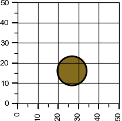

# VLM Area

VLM Area is a project that conducts post-training RL fine-tuning on [Qwen2.5-VL-7B-Instruct](https://huggingface.co/Qwen/Qwen2.5-VL-7B-Instruct), with the goal of being educational.

This work is heavily inspired by the previous work of [Brendan Hogan](https://github.com/brendanhogan/DeepSeekRL-Extended/tree/multi_modal_regression) and [TinyGRPO](https://github.com/open-thought/tiny-grpo).

The GRPO algorithm was used to train the model. A H200 GPU was used for training.

## Installation and Usage

```
pip install -r requirements.txt
```

The default arguments within `main.py` were used to train the model.

```
python main.py
```

## Area Calculation Task

The VLM was trained to calculate the area of shape on a 2D graph.

### Input

The class of shapes were a rectangle, circle, square or triangle, with a minimum and maximum dimension of 20 and 35 respectively.



Plots generated were a 0x50 grid with a random shape from classes selected, and a random RBG color with the ranges of 0.1 and 0.9.

### Reward Signals

The RL reward is composed of three components:

- **Area Correctness**: Measures how close the predicted area is to the ground truth, with a linearly scaled reward based on relative error.
- **Area Format**: Rewards correct formatting of the area value to exactly two decimal places (e.g., X.XX).
- **XML Format**: Rewards strict adherence to the required XML structure: `<reasoning>...</reasoning><answer>X.XX</answer>`.

Area correctness was most heavily weighed, with a maximum and minimum reward of 3 and -3 resptively. Area format and XML format were both rewarded 0.5

## Extension: Rotation and Size Range
