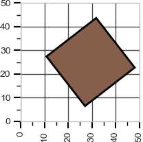

# VLM Area

VLM Area is a project that conducts post-training RL fine-tuning on [Qwen2.5-VL-7B-Instruct](https://huggingface.co/Qwen/Qwen2.5-VL-7B-Instruct), with the goal of being educational.

This work is heavily inspired by the previous work of [Brendan Hogan](https://github.com/brendanhogan/DeepSeekRL-Extended/tree/multi_modal_regression) and [TinyGRPO](https://github.com/open-thought/tiny-grpo).

The GRPO algorithm was used to train the model. A H200 GPU was used for training.

## GRPO

GRPO, the algorithm created by DeepSeek and what was used to train R1 was selected as it is has a good balanceo of efficiency and usefulness. At a high level the flow of the GRPO algorithm is:

1. Have the model do a rollout and generate a set of completions (model traces), often in parallel.
2. Some of these completions will be better than the others, specifically some will result in actions that are more alligned with the goal than others.
3. Score these completions against eachother by computing the advantage function at the token level.
4. After enough rollouts, find which tokens are good and others which are not, upweight the ones that do well.
5. Use KL divergence to constrain the behavioural space of the model, this is a form of regularisation, we want to update the model but in a fine grained or surgical way.

## Installation and Usage

```
pip install -r requirements.txt
```

The default arguments within `main.py` were used to train the model.

```
python main.py
```

## Area Calculation Task

The VLM was trained to calculate the area of shape on a 2D graph.

### Input

The class of shapes were a rectangle, circle, square or triangle, with a minimum and maximum dimension of 20 and 35 respectively.


Plots generated were a 50x50 grid with a random shape from classes selected, and a random RBG color with the ranges of 0.1 and 0.9.

### Output

The model generates thinking tokens delinated by `<think>[think here]</think>` and an output between `<answer>[predicted area]</answer>`.

### Reward Signals

The RL reward is composed of three components:

- **Area Correctness**: Measures how close the predicted area is to the ground truth, with a linearly scaled reward based on relative error.
- **Area Format**: Rewards correct formatting of the area value to exactly two decimal places (e.g., X.XX).
- **XML Format**: Rewards strict adherence to the required XML structure: `<reasoning>...</reasoning><answer>X.XX</answer>`.

Area correctness was most heavily weighed, with a maximum and minimum reward of 3 and -3 resptively. Area format and XML format were both rewarded 0.5

### Results

The model converges at ~1000 training steps for area correctness and converges much earlier for the XML format and Area format.


## Extension: Rotation and Size Range

As an extension, to challenge the model further two augmentations and training runs under the same hyperparameters were done:

1. Shape rotation between 45 and -45 degrees.



2. The dimension range was increased, from 15 to 30.

As seen in the graph below the model is able learn and generalise to the shape rotation, but struggles to generalise with a larger dimension range. Methods such as hyperparameter tuning, cold start fine tuning or defining better reward signals (such as harsher penalities for larger absolute errors for smaller shapes) may help the model learn.

